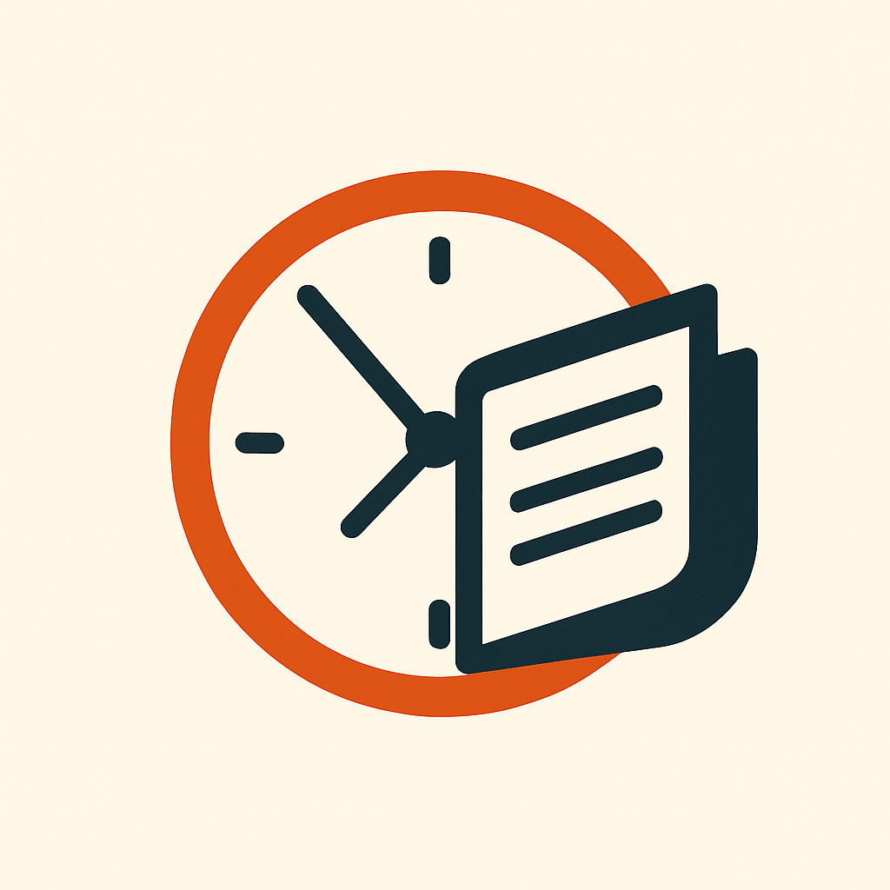
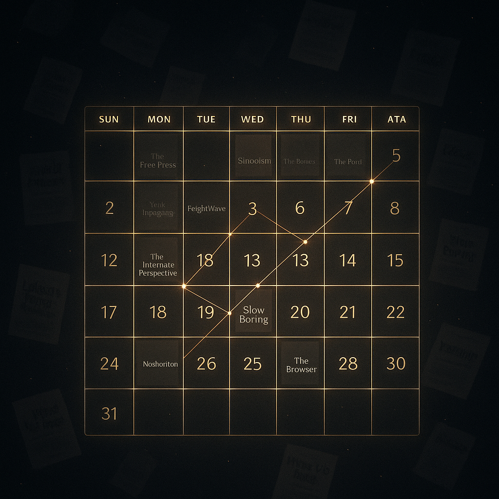

# Substack SpaceTime

Get Your Substack Token:

- Go to substack.com and log in
- Press F12 to open Developer Tools
- Go to Application → Cookies → https://substack.com
- Find the cookie named substack.sid
- Copy its value

### A calendar-based reader for longform Substack writing

Substack SpaceTime lets you explore your Substack subscriptions through time and depth, not noise. It focuses on what matters—the text.

## Features

- Fetches your personal Substack feed (using your `substack.sid` cookie)
- Filters out video, podcast, and non-text content
- Word count + reading time estimation
- Quartile-based categorization into **Quick Reads**, **Short Articles**, **Medium Pieces**, and **Deep Dives**
- Calendar and list views
- Publication frequency dashboard
- All client-side: no backend, no data stored
- Deploy easily on **GitHub Pages**

